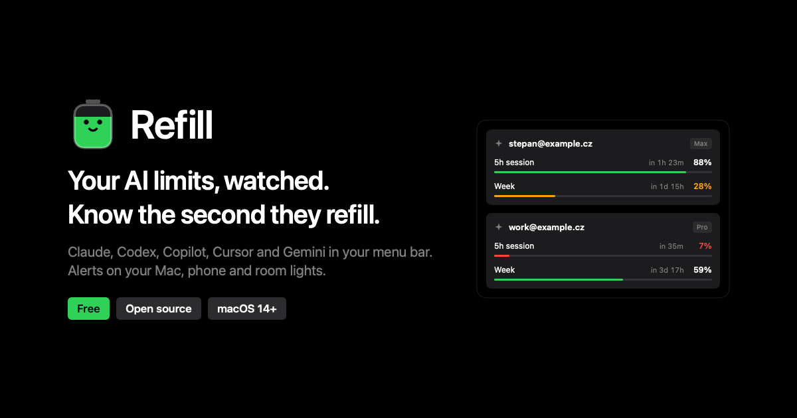

# Refill

Menu bar app for macOS that watches your AI subscription limits and signals the moment one resets.

[**Download for macOS**](https://github.com/StepanBlaha/Refill/releases/latest/download/Refill.dmg) · [Homebrew](#install) · [Website](https://stepanblaha.github.io/Refill/) · [MIT](LICENSE)



> **Not notarized.** There is no Apple Developer license, so Gatekeeper stops a downloaded app once. Homebrew and the one-line installer clear that. The disk image needs **System Settings → Privacy & Security → Open Anyway**.

Requires macOS 14 (Sonoma) or newer. Free. No Refill account. Refill is an independent app, not affiliated with Anthropic, OpenAI, GitHub, Cursor or Google.

## What it does

Refill lives in the menu bar and shows how much of each limit you have left. When a window refills, Drip (the tank mascot) says so: a notch banner, a notification, a sound, and anything you've wired up. It also warns as you cross the thresholds you set (80% and 95% by default) and when a tank hits empty.

A reset is **scheduled** when a known `resets_at` passes while usage was above zero (this works offline), or **observed** when a poll shows the reset time jumped forward and usage dropped. Resets are deduped per account, window and reset time.

## Install

macOS 14 (Sonoma) or newer. Settings in `~/.config/refill` are kept when you replace the app. Log into Claude Code or Codex (or Copilot, Cursor, Gemini CLI) and Refill finds the logins already on your Mac.

### Homebrew

```bash
brew install --cask stepanblaha/tap/refill
```

The cask removes the quarantine flag after install. Update with `brew upgrade --cask refill`.

### One line

```bash
curl -fsSL https://raw.githubusercontent.com/StepanBlaha/Refill/main/scripts/install.sh | bash
```

This downloads the latest `Refill.zip`, checks its sha256, replaces `/Applications/Refill.app`, clears quarantine and opens Refill. It asks for an administrator password only when `/Applications` isn't writable. Release 0.1.1 has no zip, so the script installs that disk image and checks the sha256 GitHub publishes for the file.

### By hand

1. Download [Refill.zip](https://github.com/StepanBlaha/Refill/releases/latest/download/Refill.zip) or [Refill.dmg](https://github.com/StepanBlaha/Refill/releases/latest/download/Refill.dmg). If this release has no zip yet, use the disk image. Move **Refill** to Applications.
2. Open it. When macOS says it can't verify the app, go to **System Settings → Privacy & Security → Open Anyway**. Or run `xattr -dr com.apple.quarantine /Applications/Refill.app`.

The zip is an ad-hoc signed app (`codesign --sign -`). Each release also uploads `Refill.zip.sha256` and `Refill.dmg.sha256`.

Open at login is on by default the first time you launch from `/Applications`. Change it in Settings → General.

## Sources

| Source | What Refill reads |
|---|---|
| **Claude** | Every Claude Code login: the default `~/.claude`, any `~/.claude-*` directory, and extra dirs you add in Settings. Credentials come from the Keychain item Claude Code creates. Usage comes from `api.anthropic.com/api/oauth/usage` (5-hour session, week, week-Opus/Sonnet). Expired tokens are refreshed and written back to the Keychain. |
| **Codex CLI** | Live usage for each Codex home (`~/.codex`, still the account id `codex:default`, plus `CODEX_HOME`, every `~/.codex-*` and `~/.codex_*` folder, and extra folders in Settings). Refill uses the ChatGPT login in that home's `auth.json`, or the `Codex Auth` Keychain item, and asks `chatgpt.com/backend-api/wham/usage`. An expired access token is refreshed and written back. If that request fails, the newest session log is a fallback, and a window whose reset has already passed is shown as — rather than a full tank. |
| **GitHub Copilot** | Premium requests and chat quota for every `github.com` login `gh auth status` lists. The login Refill already tracked stays `copilot:default`. If `gh` has no github.com login, the editor token in `~/.config/github-copilot/` is still that one account. Resets monthly. |
| **Cursor** | Monthly usage from the one Cursor login on this Mac (`state.vscdb`, read-only). Cursor stores a single login per Mac user, so Refill does too. |
| **Gemini CLI** | Per-model quota for each Gemini CLI config: `~/.gemini` (still `gemini:default`), `GEMINI_CLI_HOME` (creds in `<home>/.gemini/oauth_creds.json`), `~/.gemini-*`, `~/.gemini-accounts/<name>`, and extra folders. Pro and Flash are tracked separately. A refreshed token stays in memory. |

Copilot, Cursor and Gemini are skipped unless they look installed, and each can be turned off in Settings. HTTP 429 pauses that account (honors `Retry-After`, otherwise 15 minutes). "Renew expired logins" can be turned off in Settings → Accounts so Refill doesn't race Claude Code or Codex for a refresh token.

Rename any account from the **⋯** menu. The name is stored for that account id and shown in the menu, the notch, the dashboard, widgets and notifications. A blank name falls back to the email, then the folder name.

Add another account from a clone of the repo, or from **Settings → Accounts**:

```bash
scripts/add-claude-account.sh work   # CLAUDE_CONFIG_DIR=~/.claude-work claude → /login
scripts/add-codex-account.sh work    # CODEX_HOME=~/.codex-work codex login
scripts/add-gemini-account.sh work   # GEMINI_CLI_HOME=~/.gemini-accounts/work gemini
```

A longer walkthrough, including the sleep-time ntfy push, is in [docs/SETUP.md](docs/SETUP.md).

## Signals

Step-by-step setup for every account and integration: [Setup guides](https://stepanblaha.github.io/Refill/guides/) or [docs/GUIDES.md](docs/GUIDES.md).

Each event (`reset`, `warning`, `empty`, `test`) carries a title and a message in Drip's voice, plus a color (green, orange, red).

| Sink | Details |
|---|---|
| Notch | Drip slides out of the MacBook notch. Turn it off in Settings → General. |
| Notification + sound | Settings → General. Quiet hours mute the sound; lights and hooks still fire unless you also mute phone and chat pushes. |
| Shell hook | `~/.config/refill/on-reset`. Event JSON on stdin, plus `REFILL_KIND`, `REFILL_COLOR`, `REFILL_MESSAGE` and related env vars. |
| Integrations | Settings → Integrations. Each has a Test button and per-event toggles. Stored in `~/.config/refill/integrations.json` (mode 0600). |
| Shortcuts | URL scheme `refill://` and a distributed notification `cz.stepanblaha.refill.<kind>`. |
| Files | `~/.config/refill/status.json` and `events.jsonl`. |
| Dashboard | `http://127.0.0.1:7788` (port is configurable). Tanks, Drip, toasts and chimes. `/status` and `/events` return JSON. "Visible on Wi-Fi" exposes the same page on your LAN. |
| Widgets | Small, medium and large widgets via the shared app-group status. |

Integrations:

- **Phone:** ntfy, Pushover, Telegram. With ntfy turned on, Refill schedules each known reset ahead of time (`At` header) so the push still arrives if the Mac is asleep or off. The token stays in `integrations.json`. A Mac that is awake at the reset sends one immediate push and cancels the delayed one.
- **Chat:** Discord, Slack
- **Lights:** Home Assistant webhook (payload includes `rgb` / `color`), Philips Hue (group flash), WLED (color or preset)
- **Custom webhook:** method, headers, and a body template with `{{kind}}` `{{title}}` `{{message}}` `{{color}}` `{{r}}` `{{g}}` `{{b}}` `{{json}}` and more

History keeps a burn-rate chart per tank so you can see whether the current pace hits empty before the reset.

## Privacy

Usage, history and settings stay in `~/.config/refill` on your Mac. There is no Refill account, no telemetry and no Refill server. Tokens are sent only to the provider they belong to, and to integrations you configure yourself. Codex session logs stay on the Mac; only the access token (and, when it has expired, the refresh token) is sent to OpenAI.

The provider usage endpoints are undocumented and can change or be restricted. Refill doesn't send prompts or spend quota.

## Building

```bash
scripts/run-xcode.sh      # full app + widgets → /Applications/Refill.app (Xcode, team FW5CYB98R7)
scripts/package.sh        # Release .dmg and .zip in build/ (set DEVELOPER_ID / NOTARY_PROFILE to sign + notarize)
swift build && swift test # compile + unit tests (reset detection, parsing, integrations)
Refill --render <dir>     # design snapshots: menu, moods, settings, history, accounts
Refill --render-og <path> # 1200×630 social banner
```

The marketing site is `site/` (Next.js, static export, GSAP, Locomotive Scroll). `npm run build` writes `site/out` with `basePath` `/Refill` for [GitHub Pages](https://stepanblaha.github.io/Refill/). It deploys on every push to `main`.

Companion iPhone app: `cd Companion && xcodegen generate`, then open `RefillCompanion.xcodeproj`. It reads the dashboard on your LAN. It is a separate project from the menu bar app.

## Releasing

```bash
scripts/release.sh 0.3.0   # tests, stamps the changelog date, tags v0.3.0, pushes → GitHub Actions publishes the .dmg, the .zip and checksums
```

The app checks GitHub Releases once a day and shows "Update available" in the menu.

`scripts/package.sh` can optionally Developer ID-sign and notarize (`DEVELOPER_ID`, `NOTARY_PROFILE`). Without that, the archives are ad-hoc signed (`codesign --sign -`) and the install note above applies.

## Project

- [Changelog](CHANGELOG.md)
- [Contributing](CONTRIBUTING.md)
- [Security](SECURITY.md)
- [Brand](branding/BRAND.md)
- [Launch notes](marketing/LAUNCH.md)

## Legal

- [LICENSE](LICENSE) (MIT)
- [Privacy Policy](legal/PRIVACY.md), [Terms of Use](legal/TERMS.md), [Third-party notices](legal/NOTICE.md)
- [Trademarks](TRADEMARKS.md)

The MIT license covers the source. It does not grant rights to the Refill name, the Drip mascot or the app icon. Forks should use their own name and icon.
